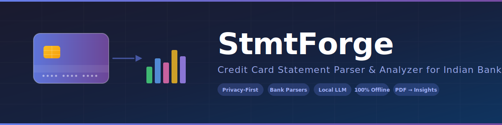

<div align="center">

<picture>
  <source media="(prefers-color-scheme: dark)" srcset="assets/banner.svg">
  <source media="(prefers-color-scheme: light)" srcset="assets/banner.svg">
  
</picture>

# StmtForge — Credit Card Statement Parser & Analyzer

**Open-source, offline-first Python tool to parse credit card PDF statements from Indian banks into structured data.**

[](https://pypi.org/project/stmtforge/)
[](https://pypi.org/project/stmtforge/)
[](https://www.python.org/downloads/)
[](LICENSE)

[Install](#installation) · [Quick Start](#quick-start) · [Supported Banks](#supported-banks) · [Dashboard](#dashboard-preview) · [Docs](#how-it-works)

</div>

---

## Why StmtForge?

Indian bank credit card statements are password-protected PDFs with inconsistent formats — making expense tracking painful. StmtForge solves this:

- **Parse PDF statements** from Indian banks (Currently implemented: HDFC, ICICI, SBI, Axis, Kotak, Yes, CSB, Federal, IDFC First)
- **100% offline** — no data leaves your machine, no cloud APIs, no telemetry
- **Hybrid extraction** — deterministic regex parsers → table extraction → OCR → local LLM (Ollama)
- **One command** — `pip install stmtforge` and start analyzing your credit card spend

> Built for anyone in India who wants to track credit card expenses without trusting third-party apps with their financial data.

---

## Dashboard Preview

StmtForge includes a **Streamlit analytics dashboard** with interactive charts, filters, and CSV export.

<div align="center">


*Analytics: total spend, monthly trends, category breakdown, top merchants, bank & card comparison, daily heatmap, drill-downs*

</div>

---

## Key Features

| Feature | Description |
|---|---|
| **9 bank-specific parsers** | Dedicated parsers for HDFC, ICICI, SBI, Axis, Kotak, Yes, CSB, Federal, IDFC First |
| **PDF unlock & parse** | Auto-decrypts password-protected statements (DOB, PAN, custom patterns) |
| **Hybrid extraction pipeline** | Deterministic → table → OCR → local LLM fallback chain |
| **Local LLM via Ollama** | Qwen / Mistral / Llama3 for unstructured statement parsing |
| **Gmail auto-fetch** | Read-only OAuth2 — downloads statement PDFs from Gmail automatically |
| **Multi-card tracking** | Track spend across multiple cards and banks |
| **Auto-categorization** | Rule-based merchant classification (Shopping, Food, Travel, EMI, etc.) |
| **Transaction deduplication** | Hash-based dedup with incremental processing |
| **Streamlit dashboard** | Interactive Plotly charts, sidebar filters, CSV export |
| **Privacy-first design** | PII redacted from logs, HMAC pseudonymization, DPDP-aligned |
| **CLI interface** | `stmtforge run`, `stmtforge dashboard`, `stmtforge init` |

---

## Installation

### From PyPI

```bash
pip install stmtforge
```

### From Source

```bash
git clone https://github.com/madhav921/stmt-forge.git
cd stmt-forge
python -m venv .venv
.venv\Scripts\activate        # Windows
# source .venv/bin/activate   # macOS / Linux
pip install -e ".[dashboard,dev]"
```

### Requirements

| Requirement | Purpose |
|---|---|
| Python 3.11+ | Runtime |
| [Ollama](https://ollama.com/) *(optional)* | Local LLM for unstructured PDF parsing |
| Google Cloud project *(optional)* | Gmail API — not needed for manual PDF import |
| qpdf *(optional)* | Fallback PDF decryption |

---

## Quick Start

```bash
# 1. Set up project
mkdir ~/my-statements && cd ~/my-statements
stmtforge init          # creates config.yaml, .env.example, data/

# 2. Configure PDF passwords
cp .env.example .env    # then edit .env with your passwords

# 3. (Optional) Set up local LLM
ollama pull qwen2.5:3b

# 4. Run the pipeline
stmtforge run --local               # parse local PDFs
stmtforge run --full                 # Gmail fetch + parse
stmtforge run --folder path/to/pdfs  # specific folder

# 5. View insights
stmtforge dashboard
```

**Manual PDF import:** Drop PDFs into `data/raw_pdfs/<bank>/` and run `stmtforge run --local`. No Gmail setup needed.

---

## Supported Banks

| Bank | Parser | Card Detection |
|---|---|---|
| HDFC Bank | `hdfc_parser` | Swiggy, Tata Neu, Millennia, etc. |
| ICICI Bank | `icici_parser` | Amazon Pay, Coral, Platinum, etc. |
| SBI Card | `sbi_parser` | Cashback, Elite, SimplyCLICK, etc. |
| Axis Bank | `axis_parser` | Neo, Flipkart, Ace, etc. |
| Kotak Mahindra | `kotak_parser` | 811, League Platinum, etc. |
| Yes Bank | `yes_parser` | Marquee, Prosperity, etc. |
| CSB Bank | `csb_parser` | Edge, etc. |
| Federal Bank | `federal_parser` | Signet, Scapia, etc. |
| IDFC First Bank | `idfc_first_parser` | First Select, Classic, WOW, etc. |
| *Any other bank* | `generic_parser` + LLM | Auto-detected |

> Statement formats change over time. Open an issue if a parser produces incorrect results.

---

## How It Works

```
PDF → Unlock → Bank Parser → Table Extraction → OCR → LLM → Validate → SQLite → Dashboard
```

1. **PDF Unlock** — Tries password combos (DOB, PAN, custom) via pikepdf
2. **Bank Parser** — Bank-specific regex parser extracts transactions directly
3. **Fallback Chain** — Table extraction (pdfplumber) → Layout text → OCR (Tesseract) → Local LLM (Ollama)
4. **Validation** — Date normalization, amount bounds, dedup, confidence scoring
5. **Categorization** — Rule-based merchant → category mapping
6. **Storage** — SQLite with transaction-level deduplication and incremental processing

---

## Privacy & Security

StmtForge is built around a **local-first, zero-upload** architecture.

| | |
|---|---|
| **Processing** | 100% local — no cloud, no external APIs |
| **Storage** | Local SQLite + local files only |
| **Telemetry** | None — no analytics, no phone-home |
| **Log privacy** | PII auto-redacted (emails, phones, PAN, card numbers) |
| **PDF passwords** | `.env` → memory only; never logged or stored in DB |
| **Gmail** | Optional, read-only OAuth2; revoke anytime at [Google Permissions](https://myaccount.google.com/permissions) |

See [SECURITY.md](SECURITY.md) for vulnerability reporting and full security policy.

---

## Configuration

`stmtforge init` creates a `config.yaml` with these sections:

| Section | Purpose |
|---|---|
| `gmail` | Sender domains, search keywords, attachment filters |
| `credit_cards` | Your banks and card names |
| `pdf_passwords` | Password patterns (from `.env`) |
| `parsers` | Email/filename → bank mapping, card identifiers |
| `categories` | Merchant → category rules |
| `database` | SQLite path |
| `llm` | Ollama model, URL, temperature |

---

## Adding a New Bank Parser

```python
from stmtforge.parsers.base_parser import BaseParser, parse_date, parse_amount

class MyBankParser(BaseParser):
    BANK_NAME = "mybank"

    def parse(self, pdf_path):
        records = [...]  # Extract transactions
        return self._get_standard_df(records)
```

Register in `src/stmtforge/parsers/registry.py` and add mappings in `config_template.yaml`.
See [CONTRIBUTING.md](CONTRIBUTING.md) for details.

---

## Project Structure

```
stmt-forge/
├── src/stmtforge/           # Package source
│   ├── cli.py               # CLI entry point
│   ├── run_pipeline.py      # Pipeline orchestrator
│   ├── hybrid_pipeline.py   # Hybrid extraction engine
│   ├── parsers/             # 9 bank parsers + generic + categorizer
│   ├── dashboard/           # Streamlit analytics app
│   ├── pdf_processing/      # PDF unlock & text extraction
│   ├── llm/                 # Ollama client & prompts
│   ├── gmail/               # Gmail OAuth & fetcher
│   ├── database/            # SQLite layer
│   ├── validator/           # Transaction validation
│   └── utils/               # Config, logging, privacy, hashing
├── tests/                   # Test suite
├── pyproject.toml           # Build config
└── README.md
```

---

## Contributing

Bug reports, new bank parsers, and code fixes welcome. See [CONTRIBUTING.md](CONTRIBUTING.md).

## License

[MIT](LICENSE)
